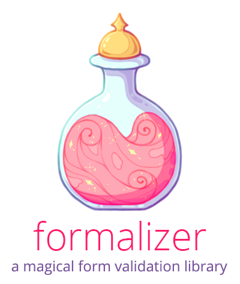

[](https://travis-ci.com/nosachamos/formalizer)
[](https://codecov.io/gh/nosachamos/formalizer)

[](https://github.com/prettier/prettier)


Formalizer is a React Hooks based form validation library made for humans. The cleanest code or your money back.



Simple, tiny, extensible, intuitive, documented, fully tested, magical.

# Installation

```sh
yarn add formalizer
```

or

```sh
npm install formalizer --save
```

# Sample Usage

```jsx
import { useFormalizer, mustMatch } from 'formalizer';

const UserProfileComponent = () => {
  const formRef = useRef(null);
  const { useInput, errors, isValid } = useFormalizer(formRef);

  return (
    <form ref={formRef}>
      <input {...useInput('name', ['isRequired'])} />
      <span>{errors['name']}</span>

      <input {...useInput('email', ['isRequired', 'isEmail'])} />
      <span>{errors['email']}</span>

      <button disabled={!isValid} type="submit">
        Submit
      </button>
    </form>
  );
};
```

For a complete guide on how each of these pieces work, see our [tutorial](tutorial.md).

# In a Nutshell

Use the `useFormalizer` hook to gain access to the `useInput` hook, the errors currently in your form, whether the form is valid or not [and more](useformalizer-hook.md).

Then, use the `useInput` to [setup validations](examples.md) on your form inputs.

Formalizer offers two [built in validators](builtin-validators.md) out-of-the-box and it integrates with the awesome [validator](https://www.npmjs.com/package/validator) library seamlessly, which means if you install it [you can use all of their validators](third-party-validators.md).

But know that writing your own [custom validators](custom-validators.md) is super easy.

Also, you may create [global validators](global-validators.md) so that they accessible throughout your app. Doing so helps keep your code DRY and facilitates maintaining it.

Finally, if you use [Material UI](https://material-ui.com/) you may like the fact Formalizer [integrates](material-ui.md) with it. If you use some other UI framework, changes are you can tweak our [settings](settings.md) to make to work with it.
